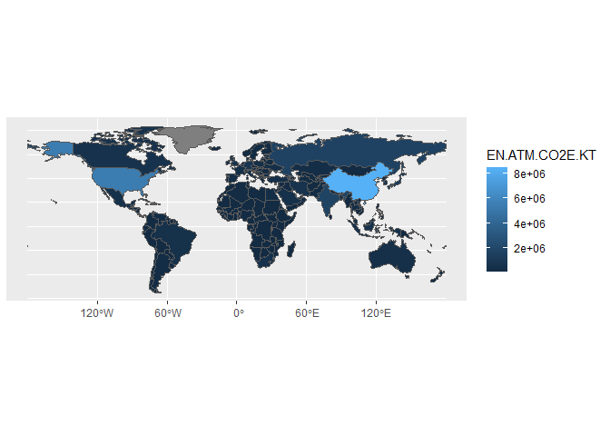

# Data Exploring and Plotting

Todays topics:

- Recap of pivoting and data exploration
- Plotting WDI data with polygons

## Topic Overview

Today we want to dig deeper into the general topic of exploration of
data which is the combination of transforming data and visualize them.


We want to work with the WDI data again and plot them on a world map.
Therefore please load the data as we did in the last class. We will need
`wdi_data`, `wdi_country` and `wdi_series`. Please load the according
tidyverse package as well.

``` r
library(tidyverse)
```

    ## ── Attaching core tidyverse packages ──────────────────────── tidyverse 2.0.0 ──
    ## ✔ dplyr     1.1.3     ✔ readr     2.1.4
    ## ✔ forcats   1.0.0     ✔ stringr   1.5.0
    ## ✔ ggplot2   3.4.3     ✔ tibble    3.2.1
    ## ✔ lubridate 1.9.3     ✔ tidyr     1.3.0
    ## ✔ purrr     1.0.2     
    ## ── Conflicts ────────────────────────────────────────── tidyverse_conflicts() ──
    ## ✖ dplyr::filter() masks stats::filter()
    ## ✖ dplyr::lag()    masks stats::lag()
    ## ℹ Use the conflicted package (<http://conflicted.r-lib.org/>) to force all conflicts to become errors

``` r
filename = "../data/WDI_CSV.zip"
wdi_data <- 
  filename %>%
  unz("WDICSV.csv" ) %>%
  read_csv
```

    ## Rows: 392882 Columns: 67
    ## ── Column specification ────────────────────────────────────────────────────────
    ## Delimiter: ","
    ## chr  (4): Country Name, Country Code, Indicator Name, Indicator Code
    ## dbl (63): 1960, 1961, 1962, 1963, 1964, 1965, 1966, 1967, 1968, 1969, 1970, ...
    ## 
    ## ℹ Use `spec()` to retrieve the full column specification for this data.
    ## ℹ Specify the column types or set `show_col_types = FALSE` to quiet this message.

``` r
wdi_country <- 
  filename %>%
  unz("WDICountry.csv" ) %>%
  read_csv
```

    ## Rows: 265 Columns: 31
    ## ── Column specification ────────────────────────────────────────────────────────
    ## Delimiter: ","
    ## chr (25): Country Code, Short Name, Table Name, Long Name, 2-alpha code, Cur...
    ## dbl  (3): National accounts reference year, Latest industrial data, Latest t...
    ## lgl  (3): Alternative conversion factor, PPP survey year, Latest water withd...
    ## 
    ## ℹ Use `spec()` to retrieve the full column specification for this data.
    ## ℹ Specify the column types or set `show_col_types = FALSE` to quiet this message.

``` r
wdi_series <- 
  filename %>%
  unz("WDISeries.csv" ) %>%
  read_csv
```

    ## Warning: One or more parsing issues, call `problems()` on your data frame for details,
    ## e.g.:
    ##   dat <- vroom(...)
    ##   problems(dat)

    ## Rows: 1477 Columns: 20
    ## ── Column specification ────────────────────────────────────────────────────────
    ## Delimiter: ","
    ## chr (19): Series Code, Topic, Indicator Name, Short definition, Long definit...
    ## lgl  (1): Other web links
    ## 
    ## ℹ Use `spec()` to retrieve the full column specification for this data.
    ## ℹ Specify the column types or set `show_col_types = FALSE` to quiet this message.

## Recap: Transform and Manage data

It is important to understand the tables before working with them.
Therefore we have a look at all columns:

``` r
colnames(wdi_data)
```

    ##  [1] "Country Name"   "Country Code"   "Indicator Name" "Indicator Code"
    ##  [5] "1960"           "1961"           "1962"           "1963"          
    ##  [9] "1964"           "1965"           "1966"           "1967"          
    ## [13] "1968"           "1969"           "1970"           "1971"          
    ## [17] "1972"           "1973"           "1974"           "1975"          
    ## [21] "1976"           "1977"           "1978"           "1979"          
    ## [25] "1980"           "1981"           "1982"           "1983"          
    ## [29] "1984"           "1985"           "1986"           "1987"          
    ## [33] "1988"           "1989"           "1990"           "1991"          
    ## [37] "1992"           "1993"           "1994"           "1995"          
    ## [41] "1996"           "1997"           "1998"           "1999"          
    ## [45] "2000"           "2001"           "2002"           "2003"          
    ## [49] "2004"           "2005"           "2006"           "2007"          
    ## [53] "2008"           "2009"           "2010"           "2011"          
    ## [57] "2012"           "2013"           "2014"           "2015"          
    ## [61] "2016"           "2017"           "2018"           "2019"          
    ## [65] "2020"           "2021"           "2022"

To properly pivot the data into any dimension, we first make one long
table. Moving into this direction is called `pivoting longer` in R.

``` r
wdi_data_piv_long <- wdi_data %>%
  pivot_longer(`1960`:`2021`,
               names_to = "Year",
               values_drop_na = TRUE) %>%
  mutate(Year = as.integer(Year))
```

Dimensions of the data: Country, Indicator, Year

To pivot wide again, `pivot_wider` gives the possibility to extend the
table again according to the data. In our case we are mainly interested
to access the data by country and year.

``` r
wdi_data_piv <- wdi_data_piv_long %>%
  pivot_wider(id_cols = c('Country Code', 'Year'), names_from = 'Indicator Code')
```

This pivoted data is now tidy for exploration and plotting. First we
want to find a nice indicator in the data to dive deeper into.

``` r
print(wdi_data %>%
  select(`Indicator Code`, `Indicator Name`) %>%
  filter(str_detect(`Indicator Name`, 'CO2 emissions')), n=30)
```

    ## # A tibble: 4,256 × 2
    ##    `Indicator Code`     `Indicator Name`                                        
    ##    <chr>                <chr>                                                   
    ##  1 EN.ATM.CO2E.KD.GD    CO2 emissions (kg per 2015 US$ of GDP)                  
    ##  2 EN.ATM.CO2E.PP.GD.KD CO2 emissions (kg per 2017 PPP $ of GDP)                
    ##  3 EN.ATM.CO2E.PP.GD    CO2 emissions (kg per PPP $ of GDP)                     
    ##  4 EN.ATM.CO2E.KT       CO2 emissions (kt)                                      
    ##  5 EN.ATM.CO2E.PC       CO2 emissions (metric tons per capita)                  
    ##  6 EN.CO2.ETOT.ZS       CO2 emissions from electricity and heat production, tot…
    ##  7 EN.ATM.CO2E.GF.ZS    CO2 emissions from gaseous fuel consumption (% of total)
    ##  8 EN.ATM.CO2E.GF.KT    CO2 emissions from gaseous fuel consumption (kt)        
    ##  9 EN.ATM.CO2E.LF.ZS    CO2 emissions from liquid fuel consumption (% of total) 
    ## 10 EN.ATM.CO2E.LF.KT    CO2 emissions from liquid fuel consumption (kt)         
    ## 11 EN.CO2.MANF.ZS       CO2 emissions from manufacturing industries and constru…
    ## 12 EN.CO2.OTHX.ZS       CO2 emissions from other sectors, excluding residential…
    ## 13 EN.CO2.BLDG.ZS       CO2 emissions from residential buildings and commercial…
    ## 14 EN.ATM.CO2E.SF.ZS    CO2 emissions from solid fuel consumption (% of total)  
    ## 15 EN.ATM.CO2E.SF.KT    CO2 emissions from solid fuel consumption (kt)          
    ## 16 EN.CO2.TRAN.ZS       CO2 emissions from transport (% of total fuel combustio…
    ## 17 EN.ATM.CO2E.KD.GD    CO2 emissions (kg per 2015 US$ of GDP)                  
    ## 18 EN.ATM.CO2E.PP.GD.KD CO2 emissions (kg per 2017 PPP $ of GDP)                
    ## 19 EN.ATM.CO2E.PP.GD    CO2 emissions (kg per PPP $ of GDP)                     
    ## 20 EN.ATM.CO2E.KT       CO2 emissions (kt)                                      
    ## 21 EN.ATM.CO2E.PC       CO2 emissions (metric tons per capita)                  
    ## 22 EN.CO2.ETOT.ZS       CO2 emissions from electricity and heat production, tot…
    ## 23 EN.ATM.CO2E.GF.ZS    CO2 emissions from gaseous fuel consumption (% of total)
    ## 24 EN.ATM.CO2E.GF.KT    CO2 emissions from gaseous fuel consumption (kt)        
    ## 25 EN.ATM.CO2E.LF.ZS    CO2 emissions from liquid fuel consumption (% of total) 
    ## 26 EN.ATM.CO2E.LF.KT    CO2 emissions from liquid fuel consumption (kt)         
    ## 27 EN.CO2.MANF.ZS       CO2 emissions from manufacturing industries and constru…
    ## 28 EN.CO2.OTHX.ZS       CO2 emissions from other sectors, excluding residential…
    ## 29 EN.CO2.BLDG.ZS       CO2 emissions from residential buildings and commercial…
    ## 30 EN.ATM.CO2E.SF.ZS    CO2 emissions from solid fuel consumption (% of total)  
    ## # ℹ 4,226 more rows

To get along better with such big tables which are about exploring,
sometimes it’s easier to organise descriptions. Even better is a full
description from `wdi_series`. here we have to merge the tables before.
Because there is no full description for every Code, we will use a left
join. We will save the data in case we want to look at it from another
program.

``` r
description1 <- wdi_data %>% select(`Indicator Code`, `Indicator Name`) %>% unique
description2 <- wdi_series %>% select(`Series Code`, `Long definition`) %>% unique
description <- left_join(description1, description2, by = c('Indicator Code' = 'Series Code'))
write_csv(description, "DataDescription.csv")
```

Now we can explore the description table easier and look for CO2
emissions in kt:

``` r
description %>%
  filter(str_detect(`Indicator Name`, 'CO2 emissions') & str_detect(`Indicator Name`, 'kt'))
```

    ## # A tibble: 4 × 3
    ##   `Indicator Code`  `Indicator Name`                           `Long definition`
    ##   <chr>             <chr>                                      <chr>            
    ## 1 EN.ATM.CO2E.KT    CO2 emissions (kt)                         Carbon dioxide e…
    ## 2 EN.ATM.CO2E.GF.KT CO2 emissions from gaseous fuel consumpti… Carbon dioxide e…
    ## 3 EN.ATM.CO2E.LF.KT CO2 emissions from liquid fuel consumptio… Carbon dioxide e…
    ## 4 EN.ATM.CO2E.SF.KT CO2 emissions from solid fuel consumption… Carbon dioxide e…

We are interested in total CO2 emissions in kt. Therefore we will pick
the first entry and save the code:

``` r
chosenCode <- 'EN.ATM.CO2E.KT'
```

The saved code EN.ATM.CO2E.KT we now use to get more information. The
function pull is to access

``` r
description %>%
  filter(`Indicator Code` == chosenCode) %>%
  select(`Long definition`) %>%
  pull() -> tt
```

We can also explore the pivot table in detail now:

``` r
wdi_data_piv %>%
  filter(`Country Code` == "DEU") %>%
  select(`Country Code`, Year, chosenCode)
```

    ## Warning: Using an external vector in selections was deprecated in tidyselect 1.1.0.
    ## ℹ Please use `all_of()` or `any_of()` instead.
    ##   # Was:
    ##   data %>% select(chosenCode)
    ## 
    ##   # Now:
    ##   data %>% select(all_of(chosenCode))
    ## 
    ## See <https://tidyselect.r-lib.org/reference/faq-external-vector.html>.
    ## This warning is displayed once every 8 hours.
    ## Call `lifecycle::last_lifecycle_warnings()` to see where this warning was
    ## generated.

    ## # A tibble: 62 × 3
    ##    `Country Code`  Year EN.ATM.CO2E.KT
    ##    <chr>          <int>          <dbl>
    ##  1 DEU             2000        830284.
    ##  2 DEU             2001        847678.
    ##  3 DEU             2002        833382.
    ##  4 DEU             2003        836794.
    ##  5 DEU             2004        821074.
    ##  6 DEU             2005        802383.
    ##  7 DEU             2006        814413.
    ##  8 DEU             2007        783803 
    ##  9 DEU             2008        789690.
    ## 10 DEU             2009        734806.
    ## # ℹ 52 more rows

Sometimes it is easier for further plotting to rename the axes:

``` r
wdi_data_piv %>%
  filter(`Country Code` == "DEU") %>%
  select(Year, chosenCode) %>%
  rename("Value" = chosenCode)
```

    ## # A tibble: 62 × 2
    ##     Year   Value
    ##    <int>   <dbl>
    ##  1  2000 830284.
    ##  2  2001 847678.
    ##  3  2002 833382.
    ##  4  2003 836794.
    ##  5  2004 821074.
    ##  6  2005 802383.
    ##  7  2006 814413.
    ##  8  2007 783803 
    ##  9  2008 789690.
    ## 10  2009 734806.
    ## # ℹ 52 more rows

### Exercise

Explore the data find a time series which is interesting to you. Plot
the time series and annotate the axes.

``` r
wdi_data_piv %>%
  filter(`Country Code` == "DEU") %>%
  select(Year, chosenCode) %>%
  drop_na() %>%
  rename("Value" = chosenCode) %>%
  ggplot +
  aes(x = Year, y = Value) + 
  geom_line() +
  labs(y = "CO emissions in kt") +
  labs(title = "CO 2 emissions in Germany")
```

<!-- -->

An alternative is to use `.data[[chosenCode]]` in `aes` except of
renaming:

``` r
wdi_data_piv %>%
  filter(`Country Code` == "DEU") %>%
  select(Year, chosenCode) %>%
  drop_na() %>%
  ggplot +
  aes(x = Year, y = .data[[chosenCode]]) + 
  geom_line() +
  labs(y = "CO emissions in kt") +
  labs(title = "CO 2 emissions in Germany")
```

<!-- -->

## Plotting on map: Polygons

Next to the table data is would be nice to get a broader overview. For
this we will need the following library loads:

``` r
library(sf)
```

    ## Linking to GEOS 3.11.2, GDAL 3.6.2, PROJ 9.2.0; sf_use_s2() is TRUE

``` r
library(rnaturalearth)
```

    ## Support for Spatial objects (`sp`) will be deprecated in {rnaturalearth} and will be removed in a future release of the package. Please use `sf` objects with {rnaturalearth}. For example: `ne_download(returnclass = 'sf')`

``` r
library(rnaturalearthdata)
```

    ## 
    ## Attache Paket: 'rnaturalearthdata'

    ## Das folgende Objekt ist maskiert 'package:rnaturalearth':
    ## 
    ##     countries110

Here we will load the according positions of countries.

``` r
countries_sf <- ne_countries(returnclass = "sf")
```

The `sf` data is a kind of data.frame with specific annotations to plot
features of countries. This enables the possibility to plot the world
map with the countries.

``` r
countries_sf %>% ggplot + geom_sf()
```

<!-- -->

To plot the WDI data into this map, we will have a look at the
`wdi_countries` data more detailed. It is suitable to merge the data
from the table to the `wdi_data` pivot table along the country codes.

``` r
colnames(wdi_country)
```

    ##  [1] "Country Code"                                     
    ##  [2] "Short Name"                                       
    ##  [3] "Table Name"                                       
    ##  [4] "Long Name"                                        
    ##  [5] "2-alpha code"                                     
    ##  [6] "Currency Unit"                                    
    ##  [7] "Special Notes"                                    
    ##  [8] "Region"                                           
    ##  [9] "Income Group"                                     
    ## [10] "WB-2 code"                                        
    ## [11] "National accounts base year"                      
    ## [12] "National accounts reference year"                 
    ## [13] "SNA price valuation"                              
    ## [14] "Lending category"                                 
    ## [15] "Other groups"                                     
    ## [16] "System of National Accounts"                      
    ## [17] "Alternative conversion factor"                    
    ## [18] "PPP survey year"                                  
    ## [19] "Balance of Payments Manual in use"                
    ## [20] "External debt Reporting status"                   
    ## [21] "System of trade"                                  
    ## [22] "Government Accounting concept"                    
    ## [23] "IMF data dissemination standard"                  
    ## [24] "Latest population census"                         
    ## [25] "Latest household survey"                          
    ## [26] "Source of most recent Income and expenditure data"
    ## [27] "Vital registration complete"                      
    ## [28] "Latest agricultural census"                       
    ## [29] "Latest industrial data"                           
    ## [30] "Latest trade data"                                
    ## [31] "Latest water withdrawal data"

``` r
wdi_data_extra <- wdi_country %>%
  select(`Country Code`, `Short Name`, Region, `Income Group`,
         `System of trade`, `Government Accounting concept`) %>%
  full_join(wdi_data_piv, by="Country Code")
```

To plot these data according with the `sf_countries`, we need to add the
pivot table as features to the `countries_sf` data. We will use an
`inner_join` to be sure there will be no wrong data. For pure overviews
and to grab a genereal idea of the data and plots, this is absolutely
ok. If you want to publish articles, you should be more specific here.

``` r
wdi_data_extra_sf <- inner_join(countries_sf, wdi_data_extra,
                                by = c("iso_a3_eh" = "Country Code"))
```

The final data `wdi_data_extra_sf` is the final result for data
wrangling and ready to plot all kinds of features on a world map:

``` r
wdi_data_extra_sf %>%
  filter(Year == 2010) %>%
  ggplot +
  aes(fill = .data[[chosenCode]]) +
  geom_sf()
```

<!-- -->

### Exercises

- read the help page `?dplyr::join`. What are the differences between
  `full_join`, `inner_join`, etc.
- `mutate` also supports creating and modifying columns. Calculate the
  nuclear and renewable power consumption per capita in 2019. Save the
  values in a new column and create a map from the results. Hint:
  Electric power consumption per capita and percentage of
  nuclear/renewable electricity.
- You have seen `group_by` and `summarize` in the `iris` example.
  Calculate the mean per capita income per region and decade. Hint:
  Adjusted net national income per capita, How can you get the decade
  programatically?
