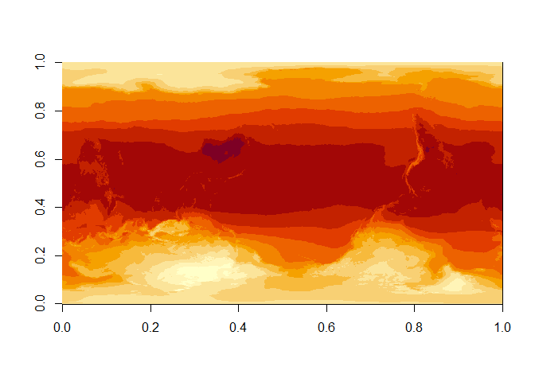

# Geo Data Plotting

Todays topics:

- plot and explore raster images
- Calculating trends of data cubes
- Plotting single points in maps

## Topic Overview

Today we want to continue our project based on the NetCDF data which was
provided last time. You can download the sample project from Moodle or
continue your own project. The result of today should be a finished
document created from RMarkdown and a complete R project.


## Recap

Remember the last exercise from last lecture? It was about creating a
trend for a specific location on earth. We created several functions
which gave us an easier access to the data and find specific locations
based on the latitude/longitude grid. Also we found out how to work with
the data and how to access the specific data.

Today we want to extend this idea to the whole world map. In this way we
can show the different trends of our linear model on the whole globe.
The results are going to be presented in a R Markdown document.

**Exercise**

To properly recap the modelling situation so far, please repeat the
process you modeled for another location. Pick any location from a map
tool like Google Maps or OpenStreetMap and feed it into your algorithm.

## simple data plots

To finally work with raster data, we want to extract a whole raster
instead of a single time series. for this we will simply extract the
whole map and only one time step. This map is strictly speaking only an
image. So we can plot it as an image.

``` r
t2m_data <- ncvar_get(t2m_nc, "t2m",
  start=c(1,1,1,1),
  count=c(-1,-1,1,1)) - 273.15
image(t2m_data)
```

<!-- -->

**Exercise**

- As you see the plot is upside down. Use different indexing to turn it
  around and plot it with `image`

## Data tidying

So far we were able to extract time series as tibbles and maps as
complete arrays. But in these arrays, the spatial information is not
stored anymore. Therefore we will go into this problem further.

We remember, that there was a problem with different experiment
versions. We also want to clean that up and want to tidy the data of all
map layers, which consists of `NA` values entirely.

For this we will not use the simple `ncdf4` package anymore, but a
higher class API called `terra`. This is a new development with better
functionality of the package `raster`. The new API is faster and better.
The syntax is different, but the general ideas are still the same to
`raster`.

`terra` offers the possibility to load netCDF files directly:

``` r
library(terra)
t2m_ras <- rast("data/era5_temperature2m.nc")
t2m_ras_new <- t2m_ras["t2m_expver=1_*"]
t2m_ras_new <- t2m_ras_new[[1:501]]
```

Now we can have a cleaner access to the data without caring about the
`expver` variable. This also means you have to change your project
functions accordingly.

## `raster` and `terra`

- raster is old and has a lot of problems. Therefore we will skip this
  package and go to the new `terra`
- `terra` is actively developed and also offers better ways to be
  plotted with ggplot
- The ERA5 dataset has a tricky dimension which does not naturally go
  well with `terra` nor `raster`

**Alert: Rasters and ERA5 are tricky:** The complete earth in `0.25`
resolution according to ERA5 can be created with:

``` r
tt<-rast(resolution=c(0.25,0.25), xmin=-0.125, xmax=359.875, ymin=-90.125, ymax=90.125)
```

This creates a new raster set which can be interacted with as it was a 2
dimensional array. Additionally there is a `values` function. Also the
raster datasets can be saved for later use:

``` r
# check for the "processed" directory and create it if not present
if(!dir.exists("data/processed")) dir.create("data/processed")

# filling rasters:
my_raster<-rast(resolution=c(0.25,0.25), xmin=-0.125, xmax=359.875, ymin=-90.125, ymax=90.125)
my_raster[1,1] <- 42
values(my_raster) <- 1:1038240
writeCDF(my_raster, "data/processed/TestData.nc", overwrite=TRUE)

# create rasters from data:
data <- matrix(rnorm(18), nrow=3)
new_raster <- rast(data, extent=ext(-180,180,-90,90))
writeCDF(new_raster, "data/processed/moreTestData.nc", overwrite=TRUE)
```

You can also use the `ncdf4` package directly to save data in this
format. This is more tricky but on the other hand more explicit and
specific:

``` r
# using array data
ncdf_own_lon_dim <- ncdim_def("longitude", "degree_east", t2m_nc_lon)
# or reuse the dimensions directly
ncdf_own_lat_dim <- t2m_nc$dim$latitude
# creating the variable along the dimensions
ncdf_own_var <- ncvar_def("my_random", "unicorns/month",
  list(ncdf_own_lon_dim, ncdf_own_lat_dim),
  missval = -9999,
  longname = "This is some random data",
  prec = "double")
# create the dataset
ncdf_own_nc <- nc_create("data/processed/ownNetcdf4Data.nc",
                          ncdf_own_var)
# some dummy data
data <- matrix(rnorm(721*1440), nrow=721)
# write new values there
ncvar_put(ncdf_own_nc, "my_random", data,
  start = c(1, 1), count = c(-1, -1))
nc_close(ncdf_own_nc)
```

## Plotof rasters with tidyterra

Now it is about plotting `terra` raster data with `ggplot`. This can be
done through the additional `tidyterra` package.

``` r
library(tidyterra)
```

    ## 
    ## Attache Paket: 'tidyterra'

    ## Das folgende Objekt ist maskiert 'package:stats':
    ## 
    ##     filter

``` r
ggplot() + geom_spatraster(data=t2m_ras_new[[1]]) + geom_sf()
```

    ## <SpatRaster> resampled to 501000 cells for plotting

<!-- -->

Additionally you can add the world map without filling, but with the
borders alone. Here we load the packages again we know from former
classes:

``` r
library(sf)
library(rnaturalearth)
library(rnaturalearthdata)

countries_sf <- ne_countries(returnclass = "sf")
ggplot() +
  geom_spatraster(data=t2m_ras_new[[1]]) +
  geom_sf(data=countries_sf, fill=NA)
```

<!-- -->

**Exercise**

- There seems to be a problem with the mapping. What is this problem?
- Fix the problem through `rotate` the layer

**Trends**

- The file `trending.R` shows how to calculate the trends on a global
  scale. Please calculate the trends globally on a simple scale or on
  the full scale. Save the result as a netCDF. Be aware that the trend
  calculation might need some computational power.
- send a plot of the trends
